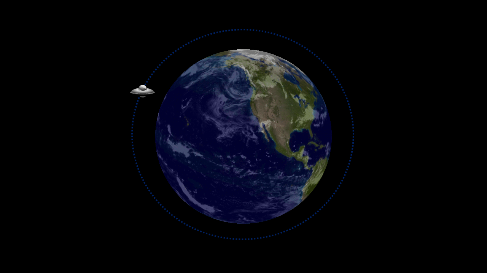

```{r setup, include=FALSE}
knitr::opts_chunk$set(echo = TRUE)
library(rmdformats)
test <- FALSE
source("./functions/auxiliary/transformations.R")
source("./functions/auxiliary/color_palettes.R")
source("./functions/plot_data.R")
source("./functions/auxiliary/auxiliary.R")
```

# Task description:

**Task set-up:** An image of planet Earth with an blue dotted orbit was presented at the center of the screen. On every trial, a spaceship would appear somewhere along the orbit, with the trial-by-trial position being sampled from a Normal distribution with some mean and standard deviation.

```{r, echo=FALSE, fig.align='center'}

```

**Instruction:** Participants were instructed to predict the position of the spaceship on the next trial by clicking somewhere along the orbit.

**Trial description:** 

0. *Trial starts.* A spaceship appears somewhere along the drawn orbit for half a second, and then disappears

1. *Participants' input.* Participants are given unlimited time to indicate the place along the circumference where they expect the spaceship to appear on the next trial.

2. *Input confirmation.* A red dot indicating the predicted location was presented inside a red circle capturing the margin error. At the same time, the spaceship showed up in its new position.

3. *Feedback.* If the spaceship fell inside the red circle, it turned red indicating the new location was accurately predicted. 

0. *NEW Trial starts.* The spaceship location observed serves as the starting point of the next trial.

<!-- > ''... participants were required to predict the future position of a spaceship moving around planet Earth along a specified orbit (...) Its location was given in radians (rad) using the center of the orbit as reference. On every trial, the spaceship appeared for half a second on a given point of its orbit, after which it disappeared. Participants had to click on the position where they thought it would reappear in the next trial. After their choice, a red dot indicated the location they selected and a red circle a fixed margin of error. At the same time, the spaceship showed up in its new position. If it fell inside the red circle, it turned red indicating the new location was accurately predicted or remained the same color otherwise. There was no time limit for participants to emit their responses. This sequence was repeated throughout the experiment. Moreover, if the spaceship gave a full lap in a counterclock-wise direction, i.e., moving 2π rad, the second lap would continue from 2π rad to 4π rad, and so on. Similarly if the spaceship completed a full lap in a clockwise direction, its next position was given according to values of the previous lap. We followed the same logic to register participant’s responses. This transformation allowed the range of possible values of observations and responses to span from -∞ to ∞, and was particularly useful to avoid sudden -->
<!-- changes of position from 2π rad to 0 every time a full lap was completed.'' -->
<!-- > -->

**No. of trials**: 300 trials per condition. 1200 trials in total.

**Conditions:** The task included the following four experimental conditions:

1. *Stationary condition*. The spaceship location on all 300 trials was determined by taking a sample of a single Normal distribution, with a mean and variance that remained fixed during the entire time.

2. *Abrupt condition*

3. *Gradual condition*

4. *Mixed condition* A mixture of the Abrupt and Gradual condition.


# Data description

The data from this experiment is stored in the following `.RData` file:

```{r}
load("./archive/abrupt_gradual.Rdata")
```

This loads an object called `ag` which holds the data in four dimensions:

- First dimension (rows) indicate trial count
- Second dimension (columns) indicate the variables observed
- Third dimension (pages) indicates the condition
- Fourth dimension (repetition) indicates the participant.

```{r}
dim(ag)
```

```{r, echo=FALSE}
I <- dim(ag)[4]
J <- dim(ag)[3]
K <- dim(ag)[1]
colnames(ag) <- c("resp", "true", "mean", "velocity", "change", "rt")

p <- 15
c <- 1
```

There were `r I` participants in this experiment, which completed `r K` trials of each of the `r J` conditions included, with a total of `r ncol(data)` variables being recorded per trial. We'll describe these variables upon looking at the first 5 observations collected for participant `r p` in condition `r c`:

```{r, echo=FALSE}
ag[1:5,,c,p]
```

For each trial, we keep track of the following information:

1. Predicted location (`resp`) - The response the participant gave when trying to predict the location of the spaceship on the next trial, measured in radians.
2. The true location (`true`) - The location (in radians) of the spaceship that the participant observes.
3. Mean location (`mean`) - The mean (in radians) of the Normal distribution from where the locations observed on every trial are observed.
4. Velocity (`velocity`) - The rate of change
5. Change-points (`change`) - A binary variable indicating whether a change has occured or not
6. RTs (`rt`) - Response time in seconds

## Transformations

All variables related to the spaceship position along the orbit (`resp`, `true` and `mean`) are measured in radians, however, they are not restricted to the $(0, 2\pi)$ interval. For example, if the spaceship had completed more than a full lap counter-clocwkise, its position could take values larger than $2\pi$. 

Velazquez, Villarreal and Bouzas (2019) modeled data obtained using the same task using three different RL models that focused on the prediction error observed on every trial. However, in order to model these data using the Circular Drift Diffusion we will need to transform the data to make it fit into the $(0, 2\pi)$ interval. To do so, we will simply keep the remainder obtained from dividing the values recorded by $2\pi$:

```{r}
ag[,"resp",,] <- ag[,"resp",,] %% (2*pi)
ag[,"true",,] <- ag[,"true",,] %% (2*pi)
ag[,"mean",,] <- ag[,"mean",,] %% (2*pi)
```

## Required cleaning steps

# Data per condition

There are four different experimental conditions in this experiment. To discuss each one of them 

```{r}
data_stationary <- ag[,,1,]  # Condition 1:  No changes
data_abrupt <- ag[,,2,]      # Condition 2: 
data_gradual <- ag[,,3,]     # Condition 3:
data_mixed <- ag[,,4,]       # Condition 4: 
```


## Stationary condition

In this first condition, the position of the spaceship on every trial was sampled from a Normal distribution with a fixed mean and standard deviation.

There are not any change-points (i.e., the `change` variable is always `0` in every trial), and the rate of change (the `velocity` variable) is always `0`.

```{r, echo=FALSE, results='hide'}
# We double-check that there are no change-points recorded in this condition, for any of the 24 participants
unique(data_stationary[,"change",])
# We double-check that the velocity (i.e. rate of change) has a fixed value of `0`, for all 24 participants
unique(data_stationary[,"velocity",])
```

For each participant, the mean of the Normal distribution from which the trial-by-trial positions are sampled is randomly selected, but it remains fixed throughout all 300 trials.

```{r}
unique(data_stationary[,"mean",])
```

```{r, fig.align='center'}
data_perCondition(data = ag, condition = 1)
```

## Abrupt condition

In this first condition, the position of the spaceship on every trial was sampled from a Normal distribution with a fixed mean and standard deviation.

There are not any change-points (i.e., the `change` variable is always `0` in every trial), and the rate of change (the `velocity` variable) is always `0`.

```{r}
abrupt_change <- data_abrupt[,"change",]
apply(abrupt_change, 2, table)
```

```{r, echo=FALSE, results='hide'}
# We double-check that the velocity (i.e. rate of change) has a fixed value of `0`, for all 24 participants
unique(data_abrupt[,"velocity",])
```

```{r, fig.align='center'}
data_perCondition(data = ag,condition = 2)
```

## Gradual condition

```{r}
gradual_change <- data_gradual[,"change",]
unique(gradual_change)
```

```{r, fig.align='center'}
data_perCondition(data = ag,condition = 3)
```

## Mixed condition

```{r}
apply(data_mixed[,"change",],2,table)
```

```{r, fig.align='center'}
data_perCondition(data = ag,condition = 4)
```
